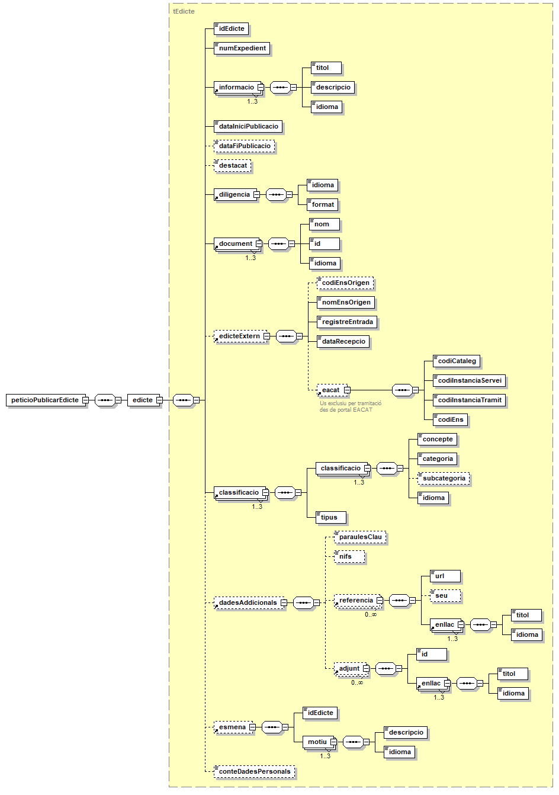
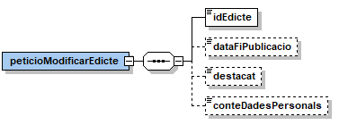
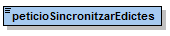

# e-TAULER
Document d’integració del servei.

Podreu trobar els XSD's del servei en aquest repositori sota el directori [/schema](https://github.com/ConsorciAOC/e-TAULER/tree/main/schema).

## Índex

- [1. Introducció](#1)
- [2. Transmissions de dades disponibles](#2)
- [3. Missatgeria dels serveis](#3)
   * [3.1 Publicar un edicte](#3.1)
      * [3.1.1. Petició – dades genèriques](#3.1.1)
      * [3.1.2. Petició – dades específiques](#3.1.2)
      * [3.1.3. Dades de l'edicte](#3.1.3)
        * [3.1.3.1. Resposta – dades específiques](#3.1.3.1)
   * [3.2. Modificar dades d’un edicte](#3.2)
        * [3.2.1.1. Petició – dades específiques](#3.2.1.1)
        * [3.2.1.2. Resposta – dades específiques](#3.2.1.2)
   * [3.3. Cancel·lar un edicte](#3.3)
        * [3.3.1.1. Petició – dades específiques](#3.3.1.1)
        * [3.3.1.2. Resposta – dades específiques](#3.3.1.2)
   * [3.4. Despenjar un edicte](#3.4)
        * [3.4.1.1. Petició – dades específiques](#3.4.1.1)
        * [3.4.1.2. Resposta – dades específiques](#3.4.1.2)
   * [3.5. Sincronització](#3.5)
        * [3.5.1.1. Petició – dades específiques](#3.5.1.1)
        * [3.5.1.2. Resposta – dades específiques](#3.5.1.2)
   * [3.6. Descàrrega de document](#3.6)
        * [3.6.1.1. Petició – dades específiques](#3.6.1.1)
        * [3.6.1.2. Resposta – dades específiques](#3.6.1.2)
   * [3.7. Consultar estat d'un edicte](#3.7)
        * [3.7.1.1. Petició – dades específiques](#3.7.1.1)
        * [3.7.1.2. Resposta – dades específiques](#3.7.1.2)
- [4. URLs del tauler](#4)
   * [4.1. Tauler d'un ens](#4.1)
   * [4.2. Detall d'un anunci](#4.2)

## 1 Introducció <a name="1"></a>

Aquest document detalla la missatgeria associada al servei E-TAULER.

Per poder realitzar la integració cal conèixer prèviament la següent documentació:

- [Document de Missatgeria Genèrica de la PCI del Consorci AOC.][PCI]

[PCI]:https://github.com/ConsorciAOC/PCI


## 2 Transmissions de dades disponibles <a name="2"></a>
Les dades disponibles a través del servei són les que es presenten a continuació:
- **EMISSOR**: CAOC (Consorci Administració Oberta de Catalunya)

| **PRODUCTE** | **MODALITAT** | **DESCRIPCIO** |
| --- | --- | --- |
| **ETAULER** | ETAULER | Operacions publicades pel servei E-TAULER: <ul><li>Publicar un edicte.</li><li>Cancel·lar un edicte pendent de publicar.</li><li>Ampliar el termini de publicació d'un edicte.</li><li>Destacar un edicte publicat.</li><li>Retirar un edicte publicat.</li><li>Sincronització: edictes que s'han publicat i retirat.</li><li>Descàrrega de document (edicte / diligència).</li><li>Consulta d'estat d'un edicte.</li></ul>|

## 3 Missatgeria dels serveis <a name="3"></a>

A continuació es detalla la missatgeria corresponent al bloc de dades específiques de les diferents operacions publicades pel producte.

> :warning: Per aquest producte NO informeu l'element IdSolicitanteOriginal de la missatgeria genèrica.

### 3.1 Publicar un edicte <a name="3.1"></a>
#### 3.1.1 Petició – dades genèriques <a name="3.1.1"></a>

El fitxer corresponent a la remesa s'ha de referenciar al bloc de dades //Ficheros/Fichero de les dades genèriques de la sol·licitud.

| _Element_ | _Descripció_ |
| --- | --- |
| //Ficheros/Fichero/Contenido | Contingut del fitxer PDF de l'edicte en cas de transferència per MTOM (en la crida correspon a la referència XOP del fitxer).|
| //Ficheros/Fichero/RutaFichero | Alternativa a Contenido, permet informa la ruta (ha de ser accessible per la plataforma PCI del CAOC) on es troba el fitxer (p.e. transferint-la prèviament per SFTP).|
| //Ficheros/Fichero/Id | Identificador de document PDF referenciat a la missatgeria específica (//edicte/document/id).|

#### 3.1.2 Petició – dades específiques <a name="3.1.2"></a>

| _Element_ | _Descripció_ |
| --- | --- |
| /peticioPublicarEdicte/edicte | Dades de l'edicte a publicar.|

#### 3.1.3 Dades de l'edicte <a name="3.1.3"></a>

| _Element_ | _Descripció_ |
| --- | --- |
| //edicte/idEdicte | Identificador alfanumèric de l'identificador d'edicte. Màxim fins a 256 caràcters.|
| //edicte/numExpedient | Identificador alfanumèric del número de l'expedient de l'edicte. Màxim fins a 256 caràcters. |
| //edicte/informacio | Bloc de dades corresponent a la informació de l'edicte (un per idioma, català obligatori). |
| //edicte/informacio/titol | Títol de l'edicte. Màxim fins a 256 caràcters. |
| //edicte/informacio/descripcio | Identificador alfanumèric de descripció de l'edicte. Màxim fins a 4000 caràcters. |
| //edicte/informacio/idioma | Idioma: <ul><li>ca: català</li><li>es: castellà</li><li>oc: aranès</li></ul>|
| //edicte/dataIniciPublicacio | Data de l'inici de la publicació de l'edicte. |
| //edicte/dataFiPublicacio | Data fi de la publicació de l'edicte (darrera data en la que l'edicte estarà visible). Si no s'informa l'edicte tindrà un temps d'exposició indefinit i per despublicar-lo caldrà realitzar una operació de retirada del mateix. |
| //edicte/destacat | L'edicte és destacat? |
| //edicte/diligencia/idioma | Idioma per defecte de la diligència: <ul><li>ca: català</li><li>es: castellà</li><li>oc: aranès</li></ul> |
| //edicte/diligencia/format | Format per defecte de la diligència: <ul><li>electronica: versió electrònica</li><li>imprimible: versió imprimible</li></ul>|
| //edicte/document | Bloc de dades corresponent al document d'un edicte (un per idioma, català obligatori). |
| //edicte/document/nom | Nom del document. |
| //edicte/document/id | El document PDF de l'edicte es referència al bloc de dades Ficheros del bloc de dades genèriques de la sol·licitud. Així, aquest element id s'ha de correspondre amb l'element Fichero/Id on s'especifica les dades per recuperar el contingut del document. |
| //edicte/document/idioma | Idioma del document: <ul><li>ca: català</li><li>es: castellà</li><li>oc: aranès</li></ul> |
| //edicte/edicteExtern/codiEnsOrigen | Camp alfanumèric per indicar el codi ens INE10 de l'ens origen en els casos d'edictes externs procedents de Catalunya. |
| //edicte/edicteExtern/nomEnsOrigen | Nom de l'ens origen de l'edicte en cas d'edictes externs. |
| //edicte/edicteExtern/registreEntrada | Camp alfanumèric per indicar el registre d'entrada de l'edicte en cas d'edictes externs. |
| //edicte/edicteExtern/dataRecepcio | Camp tipus data per indicar la data de recepció de l'edicte en cas d'edictes externs. |
| //edicte/classificacio | Bloc de dades corresponent a la classificació d'un edicte. |
| //edicte/classificacio/tipus | Tipus: <ul><li>classificacio1: criteri de classificació 1.</li><li>classificacio2: criteri de classificació 2.</li><li>procedencia: procedència.</li></ul>|
| //edicte/classificacio/classificacio | Bloc de dades corresponent a les dades d'un criteri de classificació (idioma català obligatori). |
| //edicte/classificacio/classificacio/concepte | Etiqueta descriptiva del criteri de classificació. |
| //edicte/classificacio/classificacio/categoria | Nom de la categoria. |
| //edicte/classificacio/classificacio/subcategoria | Nom de la subcategoria. |
| //edicte/classificacio/classificacio/idioma | Idioma: <ul><li>ca: català</li><li>es: castellà</li><li>oc: aranès</li></ul>|
| //edicte/dadesAddicionals/paraulesClau | Paraules clau per les que es podrà cercar l'edicte a la part del ciutadà, separades per comes (','). |
| //edicte/dadesAddicionals/nifs | NIFs vinculats amb l'edicte que es publica. |
| //edicte/dadesAddicionals/referencia | Referència externa vinculada a un edicte. |
| //dadesAddicionals/referencia/url | URL d'una referència vinculada a l'edicte. |
| //dadesAddicionals/referencia/seu | Indica si l'enllaç forma part de la seu (per defecte, si no s'informa, true). |
| //dadesAddicionals/referencia/enllaç/titol | Títol, descripció de la referència. |
| //dadesAddicionals/referencia/enllaç/idioma | Idioma:<ul><li>ca: català</li><li>es: castellà</li><li>oc: aranès</li></ul>|
| //dadesAddicionals/adjunt/id | El document adjunt es referència al bloc de dades Ficheros del bloc de dades genèriques de la sol·licitud. Així, aquest element id s'ha de correspondre amb l'element Fichero/Id on s'especifica les dades per recuperar el contingut del document. |
| //dadesAddicionals/adjunt/enllac/titol | Títol, descripció de l'adjunt. |
| //dadesAddicionals/adjunt/enllac/idioma | Idioma:<ul><li>ca: català</li><li>es: castellà</li><li>oc: aranès</li></ul> |
| //edicte/esmena | Bloc que indica que l'edicte a publicar esmena un altre edicte. |
| //esmena/idEdicte | Identificador de l'edicte que l'edicte a publicar esmena. |
| //esmena/motiu/descripcio | Motiu de l'esmena. |
| //esmena/motiu/idioma | Idioma:<ul><li>ca: català</li><li>es: castellà</li><li>oc: aranès</li></ul>|
|//edicte/conteDadesPersonals | Indica si l’edicte conté dades personals. Si conté dades personals, l'edicte no apareixerà a l'històric d'anuncis i, per tant, deixarà d'estar accessible un cop retirat.|

<p align="center">

</p>  

##### 3.1.3.1 Resposta – dades específiques <a name="3.1.3.1"></a>
| _Element_ | _Descripció_ |
| --- | --- |
| /respostaPublicarEdicte/resultat/codiResultat | Codi de resultat de la operació. <ul><li>0: operació realitzada correctament.</li><li>1: error realitzant l'operació.</li><li>2: edicte ja enregistrat.</li></ul>|
| /respostaPublicarEdicte/resultat/descripcio | Descripció del resultat de la operació.|

<p align="center">

</p>  

### 3.2 Modificar dades d’un edicte <a name="3.2"></a>

##### 3.2.1.1 Petició – dades específiques <a name="3.2.1.1"></a>

| _Element_ | _Descripció_ |
| --- | --- |
| /peticioModificarEdicte/idEdicte | Identificador de l'edicte del qual es vol ampliar el termini.|
| /peticioModificarEdicte/dataFiPublicacio | Nova data fi de la publicació de l'edicte. |
| /peticioModificarEdicte/destacat | L'edicte és destacat. |
| /peticioModificarEdicte/conteDadesPersonals | Indica si l’edicte conté dades personals. Si conté dades personals, l'edicte no apareixerà a l'històric d'anuncis i, per tant, deixarà d'estar accessible un cop retirat.|

<p align="center">

</p>  


##### 3.2.1.2 Resposta – dades específiques <a name="3.2.1.2"></a>
| _Element_ | _Descripció_ |
| --- | --- |
| /respostaModificarEdicte/resultat/codiResultat | Codi de resultat de la operació. <ul><li> 0: operació realitzada correctament.</li><li>1: error realitzant l'operació.</li></ul>|
| /respostaModificarEdicte/resultat/descripcio | Descripció del resultat de la operació. |

<p align="center">

</p>  

### 3.3 Cancel·lar un edicte <a name="3.3"></a>

##### 3.3.1.1 Petició – dades específiques <a name="3.3.1.1"></a>

| _Element_ | _Descripció_ |
| --- | --- |
| /peticioCancellarEdicte/idEdicte | Identificador de l'edicte a despenjar. |

<p align="center">

</p>  

##### 3.3.1.2 Resposta – dades específiques <a name="3.3.1.2"></a>

| _Element_ | _Descripció_ |
| --- | --- |
| /respostaCancellarEdicte/resultat/codiResultat | Codi de resultat de la operació.<ul><li>0: operació realitzada correctament.</li><li>1: error realitzant l'operació.</li></ul>|
| /respostaCancellarEdicte/resultat/descripcio | Descripció del resultat de la operació. |

<p align="center">

</p>  

### 3.4 Despenjar un edicte <a name="3.4"></a>

##### 3.4.1.1 Petició – dades específiques <a name="3.4.1.1"></a>

| _Element_ | _Descripció_ |
| --- | --- |
| /peticioDespenjarEdicte/idEdicte | Identificador de l'edicte a despenjar.|

<p align="center">

</p>  

> :warning:La despublicació d'un edicte corresponent a una esmena suposa la despublicació automàtica de l'edicte esmenat. Així mateix, la publicació d'un edicte esmentat suposa la despublicació automàtica de les esmenes.

##### 3.4.1.2 Resposta – dades específiques <a name="3.4.1.2"></a>

| _Element_ | _Descripció_ |
| --- | --- |
| /respostaDespenjarEdicte/resultat/codiResultat | Codi de resultat de la operació.<ul><li>0: operació realitzada correctament.</li><li>1: error realitzant l'operació.</li></ul>|
| /respostaDespenjarEdicte/resultat/descripcio | Descripció del resultat de la operació. |

<p align="center">

</p>  

### 3.5 Sincronització <a name="3.5"></a>

##### 3.5.1.1 Petició – dades específiques <a name="3.5.1.1"></a>

| _Element_ | _Descripció_ |
| --- | --- |
| /peticioSincronitzarEdictes | Bloc de petició de sincronització d'edictes. No requereix cap element addicional. |

<p align="center">

</p>  

##### 3.5.1.2 Resposta – dades específiques <a name="3.5.1.2"></a>

| _Element_ | _Descripció_ |
| --- | --- |
| /respostaSincronitzarEdictes/edicte/dadesEdicte | Dades de l'edicte a sincronitzar (ha canviat d'estat des de la darrera sincronització). Per més detalls vegeu l'apartat 3.1.3 d'aquest document (). |
| /respostaSincronitzarEdictes/edicte/codiEns | Codi d'ens propietari de l'edicte. |
| /respostaSincronitzarEdictes/edicte/operacio | Operació realitzada: <ul><li>publicar: l'edicte ha estat publicat</li><li>despublicar: l'edicte ha estat retirat</li></ul>|
| /respostaSincronitzarEdictes/edicte/dataProces | Data de procés de l'operació. |
| /respostaSincronitzarEdictes /resultat/codiResultat | Codi de resultat de la operació.<ul><li>0: operació realitzada correctament.</li><li>1: error realitzant l'operació.</li></ul> |
| /respostaSincronitzarEdictes/resultat/descripcio | Descripció del resultat de la operació. |

<p align="center">

</p>  

### 3.6 Descàrrega de document <a name="3.6"></a>

##### 3.6.1.1 Petició – dades específiques <a name="3.6.1.1"></a>
| _Element_ | _Descripció_ |
| --- | --- |
| /peticioConsultarDocumentEdicte/idEdicte | Identificador de l'edicte del qual es vol consultar el document. |
| /peticioConsultarDocumentEdicte/idioma | S'informa es descarrega el document corresponent a l'edicte de l'idioma indicat:<ul><li>ca: català</li><li>es: castellà</li><li>oc: aranès</li></ul>|
| /peticioConsultarDocumentEdicte/diligencia | Si s'informa, es descarrega la diligència. |
| /peticioConsultarDocumentEdicte/diligencia/idiomaDiligencia | Idioma de la diligència a descarregar:<ul><li>ca: català</li><li>es: castellà</li><li>oc: aranès</li></ul>|
| /peticioConsultarDocumentEdicte/diligencia/formatDiligencia | <ul><li>electronica: versió electrònica</li><li>imprimible: versió imprimible</li></ul>|

<p align="center">

</p>  

##### 3.6.1.2 Resposta – dades específiques <a name="3.6.1.2"></a>
| _Element_ | _Descripció_ |
| --- | --- |
| /respostaDiligenciaEdicte/diligencia | Diligència que acredita la publicació de l'edicte (base 64). |
| /respostaDiligenciaEdicte/edicte | Edicte (base 64). |
| /respostaDiligenciaEdicte/resultat/codiResultat | Codi de resultat de la operació.<ul><li>0: operació realitzada correctament.</li><li>1: error realitzant l'operació.</li></ul> |
| /respostaDiligenciaEdicte/resultat/descripcio | Descripció del resultat de la operació. |

<p align="center">

</p>  


### 3.7 Consultar estat d'un edicte <a name="3.7"></a>

##### 3.7.1.1 Petició – dades específiques <a name="3.7.1.1"></a>

| _Element_ | _Descripció_ |
| --- | --- |
| /peticioConsultarEstatEdicte/idEdicte | Identificador de l'edicte del qual es vol consultar el document. |

<p align="center">

</p>  

##### 3.7.1.2 Resposta – dades específiques <a name="3.7.1.2"></a>

| _Element_ | _Descripció_ |
| --- | --- |
| /respostaConsultarEstatEdicte/estat | Estat de l'edicte. <ul><li>0: pendent de publicar.</li><li>1: publicat.</li><li>2: retirat.</li></ul>|
| /respostaConsultarEstatEdicte/dataIniciPublicacio | Data d'inici de publicació programada. |
| /respostaConsultarEstatEdicte/dataIniciPublicacioEfectiva | Data en que l'edicte s'ha publicat. |
| /respostaConsultarEstatEdicte/dataFiPublicacio | Data de fi de publicació programada. |
| /respostaConsultarEstatEdicte/dataFiPublicacioEfectiva | Data en que l'edicte s'ha retirat. |
| /respostaConsultarEstatEdicte/dataRecepcio | Data en que l'edicte s'ha rebut al sistema. |
| /respostaConsultarEstatEdicte/resultat/codiResultat | Codi de resultat de la operació.<ul><li>0: operació realitzada correctament.</li><li>1: error realitzant l'operació.</li></ul>|
| /respostaConsultarEstatEdicte/resultat/descripcio | Descripció del resultat de la operació. |

<p align="center">

</p>  

## 4 URLs del tauler <a name="4"></a>
El frontal de E-TAULER permet accedir directament als continguts dels edictes publicats i no retirats.

- Host entorn de producció: https://tauler.seu.cat
- Host entorn de preproducció: https://tauler-pre.seu.cat

#### 4.1 Tauler d'un ens <a name="4.1"></a> 

El tauler d'un ens es publica a la URL base
```
http://<HOST ETAULER>/inici.do?idens=<CODI ENS EACAT>
```

Addicionalment es pot completar amb els següents paràmetres:

| _Paràmetre_ | _Descripció_ |
| --- | --- |
| idens | Obligatori. Codi INE10 de l'ens (codificació EACAT). |
| banner | Opcional. Mostrar capçalera (per defecte es mostra). Valors possibles: true o false. |
| lang | Opcional. Idioma (per defecte català). Valors possibles: ca (català) / es (castellà) / oc (aranès) |
| ordenacio | Opcional. Criteri d'ordenació dels anuncis. Valors possibles: publicacio si es vol ordenar per data de publicació descendent o retirada si es vol ordenar per data de fi d'exposició ascendent. Per defecte s'ordena per data de publicació. |
| categoria | Opcional. Categoria i subcategoria de l'anunci escapades en UTF-8 (p.e. Una+mat%C3%A8ria). No és necessari indicar les 2, pot especificar-se només una d'elles. |
| subcategoria |
| tipusClassificacio | Opcional. Pot ser 1, 2 ó 3. Especifica el tipus de classificació que cercarem de les 3 possibles. Cal tenir present que un mateix tipus pot tenir més d'un nom de classificació si aquest ha canviat el nom. Aquest paràmetre per tant permet agrupar-los per tipus. |
| nomClassificacio | Opcional. Nom de la classificació. Pot utilitzar-se conjuntament amb l'anterior si es vol especificar tipus i nom, o sense especificar si es vol cerca per nom sigui del tipus que sigui. |

<p align="center">

</p>  

### 4.2 Detall d'un anunci <a name="4.2"></a>

El detall d'un determinat anunci es publica a la URL base
```
http://<HOST ETAULER>/pagDetall.do?idens=<CODI ENS EACAT>&idEdicte=<ID EDICTE>
```
Addicionalment es pot completar amb els següents paràmetres:

| _Paràmetre_ | _Descripció_ |
| --- | --- |
| idens | Obligatori. Codi INE10 de l'ens (codificació EACAT). |
| idEdicte | Obligatori. Identificador d'edicte / anunci escapat per a URL en UTF-8. |
| banner | Opcional. Mostrar capçalera (per defecte es mostra). Valors possibles: true o false. |
| lang | Opcional. Idioma (per defecte català). Valors possibles: ca (català) / es (castellà) / oc (aranès) |

<p align="center">

</p>  
